# gin-vue-web

<div align="right">

[English](README_EN.md) | [中文](README.md)

</div>

一个基于 **Gin + Vue 3 + Ant Design Vue + Vite** 的 `极简 MVC Web框架`，专注于快速构建管理平台。

> 🚀 **零基础也能起飞！** 只需掌握一点点 Go 语法（会写 `struct` 就够了）、一点点前端基础（知道 `html` `css` `js` 就够用），再加上对 `MySQL` 的基本理解，就能开始全栈开发之旅！  
> 
> 🎓 **甚至不需要 Vue 基础？** 这个项目就是你的最佳练手场！边做边学，在实战中掌握 Vue 3，框架已帮你封装好复杂逻辑，你只需关注业务本身！  
> 
> ⚙️ **配置？不存在的！** 繁杂的前端编译、打包、统统帮你搞定！系统已内置 Ant Design Vue、ECharts、Font Awesome 图标等常用组件，开箱即用！你只需集中精力到核心开发，告别那些烦人的配置文件！  
> 
> 💪 **三步搞定 CRUD！** 开发？三步搞定！部署？一条命令启动！从零到上线，比写 Hello World 还快！  
> 
> ⚡ **5 分钟搭建，10 分钟跑通，30 分钟完成第一个模块！** 这不是画饼，这是真实的上手体验！🎯
> 
> 🌟 **拥抱开源，技术栈全明星阵容！** 后端 Gin（Go 界最火的 Web 框架）、前端 Vue 3（渐进式框架的标杆）、构建工具 Vite（快如闪电的构建体验）——全部采用最流行、最成熟的开源技术！这意味着你可以随心所欲地添加任何你需要的功能：想接入 ChatGPT？没问题！想集成支付系统（微信/支付宝）？轻松搞定！想加个实时聊天？WebSocket 走起！想做个数据大屏？ECharts 已内置！想接入第三方登录？OAuth 2.0 安排上！开源生态就是你的武器库，想怎么玩就怎么玩！🚀

---

## 先睹为快

> 😎 先看效果、再看原理——直接感受 gin-vue-web 带来的“所见即所得”！

### 功能演示视频

<div align="center" style="margin: 16px 0 32px;">
  <div style="display:flex;flex-wrap:wrap;gap:12px;justify-content:center;">
    <a href="docs/screenshots/gin-vue-show.webm?raw=1" target="_blank" style="padding:10px 24px;border-radius:999px;background:#ff7a18;color:#fff;font-weight:600;text-decoration:none;box-shadow:0 8px 20px rgba(255,122,24,0.35);">
      🔗 下载视频播放
    </a>
  </div>
</div>

### 功能截图展示

<table>
  <tr>
    <td align="center">
      <strong>列表页 · 搜索/排序/分页</strong><br>
      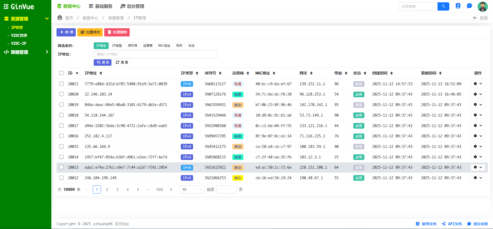
    </td>
    <td align="center">
      <strong>新增弹窗</strong><br>
      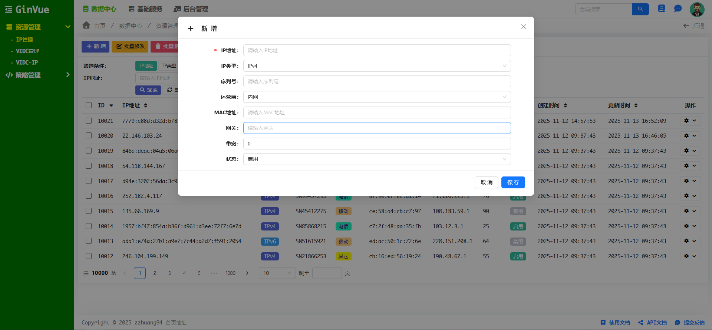
    </td>
    <td align="center">
      <strong>编辑弹窗</strong><br>
      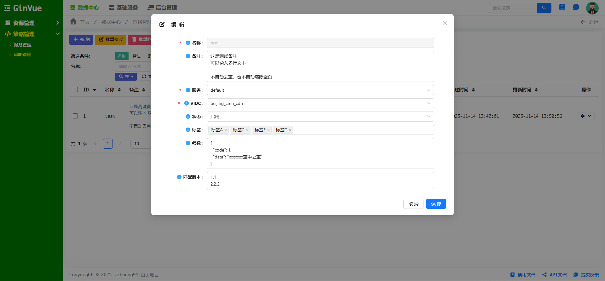
    </td>
    <td align="center">
      <strong>关联管理弹窗</strong><br>
      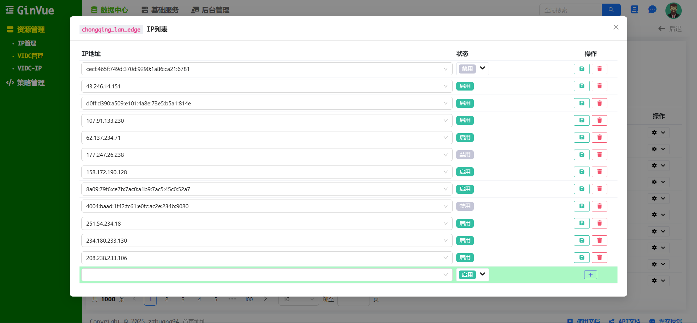
    </td>
      <td align="center">
      <strong>改动日志</strong><br>
      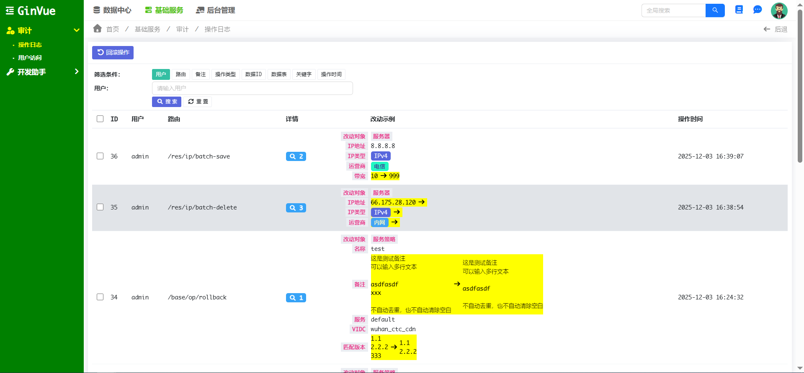
    </td>
  </tr>
  <tr>
    <td align="center">
      <strong>导航树</strong><br>
      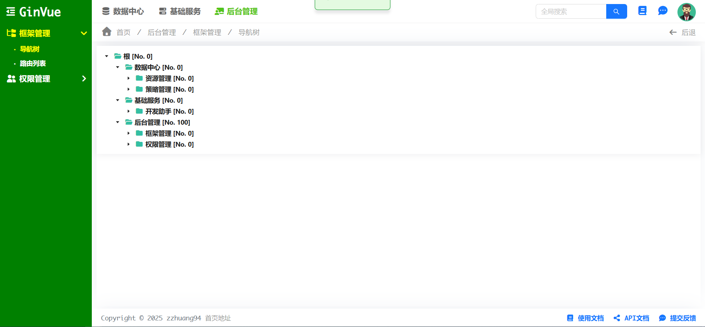
    </td>
    <td align="center">
      <strong>路由列表</strong><br>
      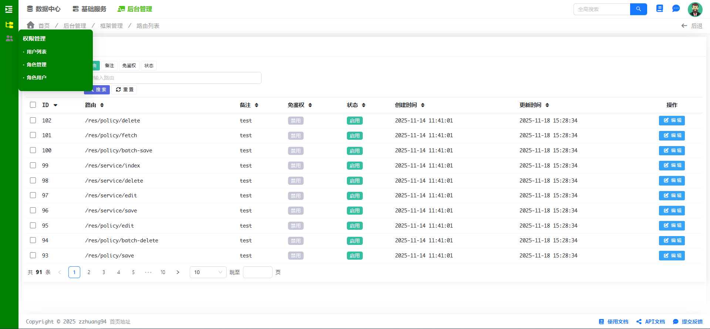
    </td>
    <td align="center">
      <strong>角色管理</strong><br>
      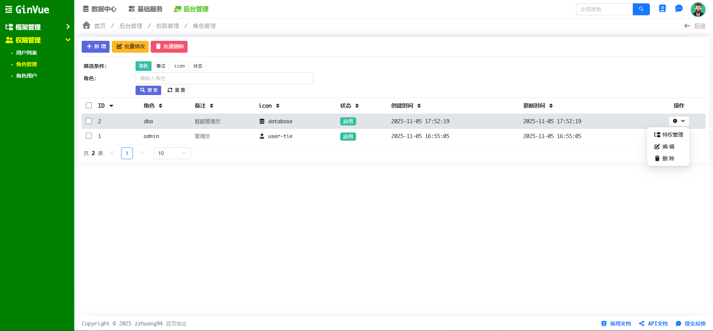
    </td>
    <td align="center">
      <strong>角色授权</strong><br>
      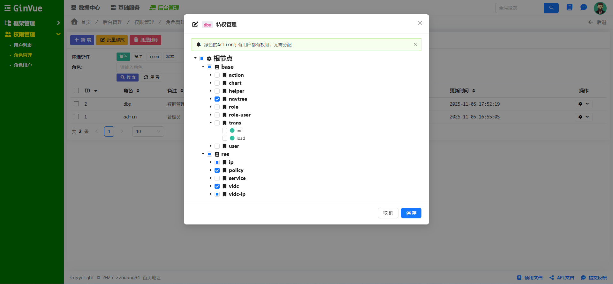
    </td>
    <td align="center">
      <strong>个人中心</strong><br>
      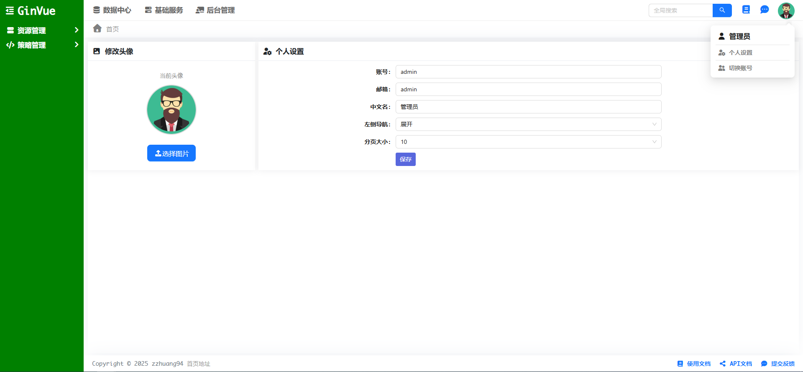
    </td>
  </tr>
  <tr>
    <td align="center">
      <strong>公共组件库</strong><br>
      
    </td>
    <td align="center">
      <strong>Echarts用例</strong><br>
      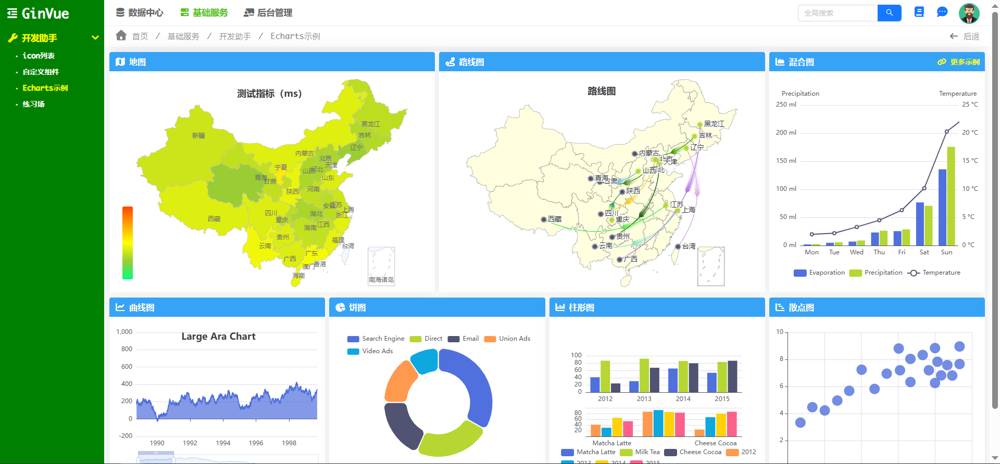
    </td>
    <td align="center">
      <strong>图标库</strong><br>
      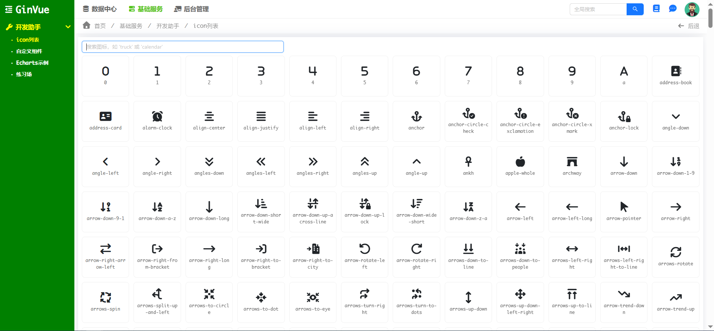
    </td>
  </tr>
</table>

---

## 📋 目录

- [一、项目介绍](#一项目介绍)
  - [1.1 极简 MVC 架构](#11-极简-mvc-架构)
  - [1.2 智能路由自动注册](#12-智能路由自动注册)
  - [1.3 通用 CRUD 框架](#13-通用-crud-框架)
  - [1.4 规则驱动开发（Rule-Driven Development）](#14-规则驱动开发rule-driven-development)
  - [1.5 内置企业级基础功能](#15-内置企业级基础功能)
- [二、快速开始](#二快速开始)
  - [2.1 环境准备](#21-环境准备)
  - [2.2 开发模式](#22-开发模式)
  - [2.3 生产环境部署指南](#23-生产环境部署指南)
- [三、如何阅读代码](#三如何阅读代码)
  - [3.1 项目结构概览](#31-项目结构概览)
  - [3.2 后端代码结构](#32-后端代码结构)
  - [3.3 前端代码结构](#33-前端代码结构)
  - [3.4 代码阅读建议](#34-代码阅读建议)
- [四、核心设计思想](#四核心设计思想)
  - [4.1 X 结构体 - 框架的核心](#41-x-结构体---框架的核心)
  - [4.2 XB 结构体 - 批量操作的扩展](#42-xb-结构体---批量操作的扩展)
  - [4.3 Rule 规则配置 - 配置驱动的力量](#43-rule-规则配置---配置驱动的力量)
  - [4.4 路由自动注册 - 零配置的魔法](#44-路由自动注册---零配置的魔法)
  - [4.5 数据流转过程 - 理解整个系统](#45-数据流转过程---理解整个系统)
- [五、调试方法](#五调试方法)
  - [5.1 从浏览器请求定位后端代码](#51-从浏览器请求定位后端代码)
  - [5.2 从页面元素定位 Vue 组件](#52-从页面元素定位-vue-组件)
  - [5.3 常见调试场景](#53-常见调试场景)
- [六、开发教程](#六开发教程)
  - [6.1 增加一个普通页面](#61-增加一个普通页面)
  - [6.2 增加一套 CRUD 功能](#62-增加一套-crud-功能)
  - [6.3 自定义功能扩展](#63-自定义功能扩展)
- [七、常见问题](#七常见问题)
- [八、许可证](#八许可证)

---

## 一、项目介绍

gin-vue-web 是一个**企业级全栈 Web 开发框架**，专为快速构建现代化管理平台而生。采用前后端分离架构，基于 Go 和 Vue 3 生态，通过**约定优于配置**的设计理念，将传统 CRUD 开发效率提升 10 倍以上。

### 1.1 极简 MVC 架构

框架采用经典的 **MVC（Model-View-Controller）架构模式**，通过智能约定和自动装配，将传统开发中的样板代码减少 80% 以上。开发者只需关注业务逻辑，框架自动处理路由、数据绑定、表单验证等繁琐工作。

**核心优势：**
- **零配置启动**：无需编写配置文件，开箱即用
- **约定优于配置**：遵循最佳实践，减少决策成本
- **高度可扩展**：支持自定义中间件、拦截器、扩展点
- **性能卓越**：基于 Gin 高性能框架，轻松应对高并发场景

### 1.2 智能路由自动注册

框架通过 **Go 反射机制**自动扫描 Controller 中的 `Action*` 方法，实现路由的零配置自动注册。告别手动维护路由表的时代，只需定义方法，路由自动生成并注册。

**技术亮点：**
- **反射扫描**：自动识别 `ActionIndex`、`ActionEdit`、`ActionSave` 等方法
- **RESTful 风格**：自动生成符合 RESTful 规范的路由
- **类型安全**：编译期检查，避免运行时错误
- **自动文档**：支持自动生成 API 文档

### 1.3 通用 CRUD 框架

框架围绕**三个核心文件**构建了一套完整的通用 CRUD 解决方案，实现了从数据模型到前端页面的全自动生成。

**核心文件架构：**

| 文件 | 职责 | 技术栈 |
|------|------|--------|
| `backend/g/x.go` | CRUD 核心逻辑引擎 | Go + XORM |
| `frontend/src/templates/index.vue` | 通用列表页模板 | Vue 3 + Ant Design Vue |
| `backend/g/rule.go` | 字段规则配置引擎 | JSON 配置驱动 |

**功能矩阵：**

| 功能模块 | 支持特性 | 说明 |
|---------|---------|------|
| **列表页** | 搜索、排序、分页、筛选 | 支持多字段组合查询 |
| **数据操作** | 新增、编辑、删除 | 单条和批量操作 |
| **数据验证** | 前端 + 后端双重验证 | 类型检查、必填验证、格式验证 |
| **权限控制** | 基于角色的访问控制 | 细粒度权限管理 |


### 1.4 规则驱动开发（Rule-Driven Development）

通过 `rule.json` 配置文件，采用**声明式编程**方式定义字段规则，实现真正的配置驱动开发。一次配置，全栈生效。

**规则配置能力：**

- **显示规则**：字段标签、显示顺序、是否可见、格式化方式
- **验证规则**：必填验证、类型验证、长度限制、正则表达式
- **搜索规则**：精确匹配、模糊搜索、范围查询、IN 查询、关联查询
- **交互规则**：下拉选项、级联选择、日期范围、文件上传

**优势：**
- **零代码配置**：无需编写验证逻辑
- **前后端同步**：一次配置，前后端自动同步
- **业务聚焦**：专注业务逻辑，而非技术细节
- **快速迭代**：修改配置即可调整功能

### 1.5 内置企业级基础功能

框架内置了**开箱即用**的企业级基础功能模块，覆盖了 90% 的管理系统通用需求，让你从第一天就开始构建业务功能。

**功能清单：**

| 功能模块 | 技术实现 | 特性说明 |
|---------|---------|---------|
| **用户认证** | Session | 支持登录、注册、账号切换 |
| **权限管理** | RBAC + 路由守卫 | 基于角色和路由的细粒度权限控制 |
| **菜单管理** | 动态菜单树 | 支持多级菜单、图标、权限绑定 |
| **会话管理** | Redis 分布式会话 | 支持集群部署、会话共享 |
| **操作日志** | 自动记录 + 回滚 | 自动记录数据变更，支持查看详情和回滚操作 |
| **组件库** | Ant Design Vue | 60+ 高质量组件，开箱即用 |
| **图表库** | ECharts | 20+ 图表类型，支持数据可视化 |
| **图标库** | Font Awesome | 1000+ 图标，满足各种场景需求 |


**操作日志功能详解：**

框架内置了强大的**操作日志（op-log）**功能，能够自动记录所有数据变更操作，并提供完整的审计和回滚能力。

**核心特性：**
- **自动记录**：根据 `op.json` 配置，自动记录 core 数据库中所有配置表的数据变更
- **事件聚合**：同一请求中的多条数据变更自动聚合为一个操作事件
- **详细记录**：记录操作类型（新增/更新/删除）、数据表、数据ID、变更前后数据
- **差异对比**：智能计算并展示字段级别的变更差异，支持字段翻译和格式化显示
- **一键回滚**：支持将数据回滚到变更前的状态，自动处理依赖关系检查
- **审计追踪**：记录操作用户、操作路径、操作时间等完整审计信息

**工作原理：**
1. 在 `op.json` 中配置需要记录的表（仅限 core 数据库）
2. 框架在数据保存/删除时自动检测并记录变更
3. 同一请求中的多条变更通过 UUID 关联，聚合为一个操作事件
4. 操作事件存储在 `base` 数据库的 `op_event` 表
5. 具体变更详情存储在 `base` 数据库的 `op_log` 表

**依赖关系检查机制：**

框架在回滚操作前会自动检查数据依赖关系，确保数据一致性。这是操作日志功能的核心设计，防止因回滚导致的数据不一致问题。

**为什么需要依赖检查？**

数据库的改动必须遵循主键-外键依赖关系，否则会导致数据不一致。例如：如果 `b.a_id = a.id`（表 b 的外键引用表 a 的主键），那么在删除数据 a 之前，必须先删除数据 b，否则数据 b 将无法映射到有效的主键，造成数据不一致。

**三种依赖关系类型：**

1. **同一条数据的连续改动依赖**
   - **场景**：同一条数据经历了多次连续改动，如 `a -> b -> c`
   - **规则**：如果回滚 `a -> b`，则必须同时回滚 `b -> c`，因为操作 2 依赖于操作 1 的结果
   - **示例**：用户先修改了订单状态为"已支付"，后又修改为"已发货"。回滚"已支付"状态时，必须同时回滚"已发货"状态

2. **主键依赖（新增数据被引用）**
   - **场景**：操作 1 新增了数据 a，操作 2 改动（或新增）数据 b，改动后 `b.a_id = a.id`
   - **规则**：如果回滚操作 1（删除新增的 a），则必须同时回滚操作 2，因为操作 2 依赖于操作 1 创建的主键
   - **示例**：先创建了分类 A（id=100），后创建了文章 B 并设置 `category_id=100`。回滚创建分类 A 时，必须同时回滚创建文章 B

3. **外键依赖（删除被引用的数据）**
   - **场景**：操作 1 改动（或删除）数据 b，改动前 `b.a_id = a.id`；操作 2 删除了数据 a
   - **规则**：如果回滚操作 1，则必须同时回滚操作 2，否则 `b.a_id` 将无法映射到有效的主键
   - **示例**：先修改了订单的客户ID为 200，后删除了客户 200。回滚修改订单时，必须同时回滚删除客户，否则订单的客户ID将指向不存在的记录

**配置方式：**

在 `op.json` 中通过 `primary` 字段配置主键-外键关系：

```json
{
    "table_a": {
        "name": "表A",
        "db": "core",
        "show": ["field1", "field2"],
        "primary": {
            "id": {
                "table_b": "a_id",
                "table_c": "a_id"
            }
        }
    }
}
```

配置说明：
- `primary`：定义主键被哪些表的外键引用
- `"id"`：主键字段名
- `"table_b": "a_id"`：表 table_b 的外键字段 `a_id` 引用了表 table_a 的主键 `id`

**检查流程：**

1. 用户选择要回滚的操作事件
2. 框架调用 `CheckRely()` 递归检查所有依赖关系
3. 如果发现依赖，自动收集所有需要一起回滚的操作事件
4. 前端展示完整的回滚列表，用户确认后统一回滚
5. 所有回滚操作在同一事务中执行，保证原子性

**设计优势：**

- **自动化**：无需手动分析依赖关系，框架自动检测
- **安全性**：防止因回滚导致的数据不一致问题
- **完整性**：递归检查，确保所有相关操作都被正确处理
- **透明性**：清晰展示需要回滚的所有操作，用户可确认后再执行

**使用场景：**
- 数据审计：追踪谁在什么时候修改了什么数据
- 错误恢复：快速回滚误操作，恢复数据到之前的状态
- 合规要求：满足企业级数据变更审计和合规要求
- 问题排查：通过操作历史快速定位问题原因

**扩展能力：**
- **插件机制**：支持自定义插件扩展
- **主题定制**：支持主题切换和自定义样式
- **国际化**：内置 i18n 支持，轻松实现多语言
- **响应式设计**：完美适配 PC、平板、移动端

---

## 二、快速开始

### 2.1 环境准备

#### 2.1.1 开发环境准备

**Go 安装：**
- 下载地址：https://golang.org/dl/ 或 https://golang.google.cn/dl/
- 推荐版本：Go 1.25.0 及以上
- 安装后验证：`go version`

**Node.js 安装：**
- 下载地址：https://nodejs.org/
- 推荐版本：Node.js v24.9.0 及以上（包含 npm）
- 安装后验证：`node -v` 和 `npm -v`

#### 2.1.2 数据库准备

**MySQL 安装：**
- 下载地址：https://dev.mysql.com/downloads/mysql/
- 或使用 Docker：`docker run -d -p 3306:3306 -e MYSQL_ROOT_PASSWORD=yourpassword mysql:8.0`
- 创建两个数据库实例 `base` 和 `core` 分别用于存储基础数据和业务数据
- 执行初始化 SQL（见 `docs/sql/init_base.sql` 和 `docs/sql/init_core.sql`）

#### 2.1.3 Redis 准备

**Redis 安装：**
- Windows：下载 https://github.com/microsoftarchive/redis/releases 或使用 WSL
- Linux/Mac：`sudo apt-get install redis-server` 或 `brew install redis`
- 或使用 Docker：`docker run -d -p 6379:6379 redis:latest`
- 启动后验证：`redis-cli ping`（应返回 `PONG`）

#### 2.1.4 配置文件

编辑 `backend/cfg.json` 注意调整数据库和redis链接为你的真实地址

### 2.2 开发模式

#### 2.2.1 后端启动

```bash
cd backend
go mod tidy
go build
./backend
```

后端默认运行在 `http://localhost:3000`

#### 2.2.2 前端启动

```bash
cd frontend
npm install
npm run dev -- --host 0.0.0.0
```

前端默认运行在 `http://localhost:5173` 和 `http://{真实服务器IP}:5173`

#### 2.2.3 登录系统

建议使用 `http://{真实服务器IP}:5173` 登录，管理员账号密码  admin/Admin321!

### 2.3 生产环境部署指南

详细的部署说明，包括生产环境配置、Nginx 配置、Docker 部署等，请查看 [部署文档](docs/DEPLOYMENT.md)。

---


## 三、如何阅读代码

### 3.1 项目结构概览

gin-vue-web 采用经典的前后端分离架构。理解这个架构是阅读代码的第一步。

**前后端分离意味着什么？**

简单来说，前端（Vue 3）和后端（Go）是完全独立的两个应用。它们通过 HTTP API 进行通信，前端负责展示和交互，后端负责数据处理和业务逻辑。这种架构的好处是前后端可以独立开发、部署和维护。

**项目目录结构**

```
gin-vue-web/
├── backend/                 # 后端代码（Go）
│   ├── api/                 # RESTful API 目录
│   │   ├── frm/            # API 框架代码
│   │   │   ├── common.go   # 通用响应函数
│   │   │   └── middleware.go # API 中间件
│   │   ├── modules/        # API 业务模块
│   │   │   └── res/        # res 模块的 API
│   │   │       ├── ip.go
│   │   │       ├── service.go
│   │   │       ├── policy.go
│   │   │       └── vidc.go
│   │   └── router.go       # API 路由配置
│   │
│   ├── web/                 # Web 界面目录
│   │   ├── frm/            # Web 框架代码
│   │   │   ├── x.go        # CRUD 核心逻辑（X 结构体）
│   │   │   ├── xb.go       # 批量操作扩展（XB 结构体）
│   │   │   ├── action.go   # 路由自动注册
│   │   │   ├── web.go      # Web 基础功能
│   │   │   ├── middleware.go # Web 中间件
│   │   │   └── ...
│   │   ├── modules/        # Web 业务模块
│   │   │   ├── base/       # 基础模块（用户、角色等）
│   │   │   │   ├── action.go
│   │   │   │   ├── user.go
│   │   │   │   └── ...
│   │   │   └── res/        # 资源模块（示例）
│   │   │       ├── ip.go
│   │   │       ├── service.go
│   │   │       └── ...
│   │   └── router.go       # Web 路由配置
│   │
│   ├── models/              # 共享数据模型（api 和 web 共用）
│   │   ├── base/           # base 模块的模型
│   │   │   ├── user.go
│   │   │   ├── role.go
│   │   │   └── ...
│   │   └── res/            # res 模块的模型
│   │       ├── ip.go
│   │       ├── service.go
│   │       └── ...
│   │
│   ├── g/                   # 共享工具（api 和 web 共用）
│   │   ├── cfg.go          # 配置管理
│   │   ├── model.go        # 基础模型
│   │   ├── rule.go         # 规则配置处理
│   │   └── op.go           # 操作日志
│   │
│   ├── libs/                # 工具库
│   ├── main.go             # 入口文件
│   ├── rule.json           # 字段规则配置
│   └── op.json             # 操作日志配置
│
├── frontend/               # 前端代码（Vue 3）
│   ├── src/
│   │   ├── components/     # 通用组件
│   │   │   ├── searcher.vue    # 搜索器
│   │   │   ├── table.vue       # 数据表格
│   │   │   ├── pager.vue       # 分页器
│   │   │   ├── edit.vue        # 编辑表单
│   │   │   └── ...
│   │   ├── modules/        # 业务页面
│   │   ├── templates/      # 页面模板
│   │   │   ├── index.vue   # 通用列表页模板
│   │   │   ├── layout.vue  # 布局模板
│   │   │   └── ...
│   │   ├── libs/           # 工具库
│   │   │   └── lib.ts      # 核心工具函数
│   │   └── app.vue         # 根组件
│   └── package.json
│
└── docs/                   # 文档
```

### 3.2 后端代码结构

后端采用**双架构设计**，将 RESTful API 和 Web 界面完全分离，同时共享数据模型和基础工具。

#### 3.2.1 API 目录（`backend/api/`）- RESTful API

API 目录提供标准的 RESTful API 接口，采用**函数式编程**方式，简单直接。

**目录结构：**
- `api/frm/`：API 框架代码
  - `common.go`：通用响应函数（Success、Error、分页等）
  - `middleware.go`：API 中间件（认证、日志等）
- `api/modules/`：API 业务模块
  - `res/`：res 模块的 API 处理函数
    - `ip.go`：IP 相关 API（GetIpList、GetIpById）
    - `service.go`：Service 相关 API
    - `policy.go`：Policy 相关 API
    - `vidc.go`：Vidc 相关 API
- `api/router.go`：API 路由配置

**特点：**
- ✅ 无状态，纯函数实现
- ✅ 标准 RESTful 响应格式
- ✅ 使用 HTTP 状态码（200、400、404、500）
- ✅ 适合外部系统调用和移动端

#### 3.2.2 Web 目录（`backend/web/`）- Web 界面

Web 目录提供 Web 界面相关的控制器，采用**面向对象**方式，继承框架基类获得丰富功能。

**目录结构：**
- `web/frm/`：Web 框架代码
  - `x.go`：CRUD 核心逻辑（X 结构体）
  - `xb.go`：批量操作扩展（XB 结构体）
  - `action.go`：路由自动注册
  - `web.go`：Web 基础功能
  - `middleware.go`：Web 中间件（Session、权限等）
- `web/modules/`：Web 业务模块
  - `base/`：基础模块（用户、角色等）
  - `res/`：资源模块（示例）

**X 结构体核心功能：**
- `DB`：数据库连接，用于执行 SQL 查询
- `Model`：数据模型，定义了要操作的数据表结构
- `Rules`：字段规则，从 `rule.json` 加载，控制字段的显示、验证、搜索等行为
- `Tool`：工具栏按钮配置，比如"新增"按钮
- `Option`：行操作按钮配置，比如每行的"编辑"、"删除"按钮
- `AndWheres`：固定查询条件，比如只显示已发布的数据
- `WrapData`：数据处理函数，可以在返回数据前进行自定义处理
- `Dump`：开启后在列表页展示"导出"按钮，可将当前搜索结果导出为 Excel

**XB 结构体：**
`XB` 是 `X` 的扩展版本，专门用于支持批量操作。它会在工具栏自动添加"批量修改"和"批量删除"按钮。

**特点：**
- ✅ 有状态，包含 DB、Model、Rules 等配置
- ✅ 自动 CRUD、批量操作、页面渲染
- ✅ 通过反射自动注册路由
- ✅ 适合复杂的 Web 界面

#### 3.2.3 共享资源

**`models/` - 共享数据模型**

所有数据模型统一放在 `models/` 目录下，被 `api` 和 `web` 共同使用：
- `models/base/`：base 模块的模型（user.go、role.go 等）
- `models/res/`：res 模块的模型（ip.go、service.go 等）

**`g/` - 共享工具**

提供配置管理、规则处理、操作日志等共享功能：
- `cfg.go`：配置管理
- `rule.go`：规则配置处理（加载和解析 `rule.json`）
- `model.go`：基础模型接口
- `op.go`：操作日志功能

**`libs/` - 工具库**

提供数据库、日志、Redis、字符串等底层工具函数。

#### 3.2.4 两种架构的对比

| 特性 | API（函数式） | Web（面向对象） |
|------|-------------|---------------|
| **代码组织** | 包级别函数 | 结构体 + 方法 |
| **状态管理** | 无状态 | 有状态（配置可复用） |
| **功能丰富度** | 基础 CRUD | 自动 CRUD + 批量操作 + 页面渲染 |
| **路由注册** | 手动注册 | 自动注册（反射） |
| **适用场景** | RESTful API | Web 界面 |

**设计优势：**
- ✅ **职责分离**：API 和 Web 各司其职，互不干扰
- ✅ **代码复用**：共享 models 和 g，避免重复代码
- ✅ **灵活扩展**：可以根据需求选择不同的实现方式
- ✅ **易于维护**：结构清晰，便于团队协作

### 3.3 前端代码结构

#### 3.3.1 核心文件

**`app.vue` - 根组件**

这是整个前端应用的入口。它监听路由变化，当用户访问不同页面时，它会调用后端 API 获取页面配置，然后动态加载对应的 Vue 组件。这种设计使得页面可以完全由后端控制，前端只需要负责渲染。

**`libs/lib.ts` - 核心工具函数**

这个文件提供了前端最常用的工具函数：
- `curl()`：调用后端 API，会自动添加 `/web` 前缀，处理请求和响应
- `loadModal()`：加载模态框组件，用于编辑、新增等弹窗操作
- `loadComponent()`：动态加载 Vue 组件
- `smartUrl()`：智能处理 URL，将相对路径转换为绝对路径

这些函数封装了前后端交互的细节，让你可以专注于业务逻辑。

**`templates/index.vue` - 通用列表页模板**

这是框架提供的通用列表页模板。它根据后端返回的规则配置，自动生成搜索表单、数据表格、分页器等组件。你不需要为每个列表页都写一遍这些代码，框架已经帮你做好了。

#### 3.3.2 组件系统

框架提供了一系列通用组件，这些组件都是可复用的：

- **`searcher.vue`**：搜索器组件，根据规则自动生成搜索表单
- **`table.vue`**：数据表格组件，支持排序、选择、行操作
- **`pager.vue`**：分页器组件
- **`edit.vue`**：编辑表单组件，根据规则自动生成表单字段
- **`button.vue`**：按钮组件，支持不同类型的按钮样式

这些组件都是基于 Ant Design Vue 构建的，提供了统一的 UI 风格和交互体验。

### 3.4 代码阅读建议

阅读代码是一个循序渐进的过程，建议按照以下顺序：

**第一步：从入口开始**

了解应用的启动流程很重要。后端从 `main.go` 开始，它会初始化数据库、加载配置、注册路由。前端从 `main.ts` 开始，它会创建 Vue 应用、注册路由、挂载到 DOM。

**第二步：理解核心框架**

重点阅读 `backend/g/x.go`，这是整个框架的核心。理解 `X` 结构体如何工作，它的每个方法做了什么，这是理解整个框架的关键。

同时，理解 `rule.json` 如何驱动前端表单和后端验证。这是框架"配置驱动"理念的体现。

**第三步：跟踪数据流**

选择一个具体的功能（比如列表查询），从前端请求开始，跟踪数据如何流转：
1. 前端发起请求
2. 后端接收请求
3. 构建查询条件
4. 执行数据库查询
5. 处理返回数据
6. 返回给前端
7. 前端更新界面

理解这个流程，你就能理解整个系统是如何工作的。

**第四步：查看示例代码**

参考 `modules/base/` 和 `modules/res/` 中的示例代码。这些是实际可用的代码，可以帮助你理解如何在实际项目中使用框架。

---

## 四、核心设计思想

### 4.1 X 结构体 - 框架的核心

`X` 结构体是整个框架的核心，理解它是理解整个框架的关键。

#### 4.1.1 设计理念：约定优于配置

框架采用了"约定优于配置"的设计理念。这意味着框架定义了一套约定，只要你遵循这些约定，框架就能自动帮你完成大部分工作。

比如，你只需要：
- 定义数据模型（Model）
- 配置字段规则（rule.json）
- 创建 Controller 并继承 `X`

框架就会自动为你生成：
- 列表页
- 搜索功能
- 新增功能
- 编辑功能
- 删除功能

你不需要写大量的样板代码，框架已经帮你做好了。

#### 4.1.2 X 结构体的核心方法

`X` 结构体提供了五个核心方法，对应 CRUD 的五个操作：

**`ActionIndex` - 列表页渲染**

当用户访问列表页时，这个方法会被调用。它会：
1. 从 `rule.json` 加载字段规则
2. 构建工具栏按钮和行操作按钮
3. 获取 URL 参数（用于搜索条件）
4. 渲染前端模板，传递所有配置信息

前端模板会根据这些配置自动生成搜索表单、数据表格等组件。

**`ActionFetch` - 数据获取**

这是列表页获取数据的核心方法。当用户搜索、排序、翻页时，前端会调用这个方法。

它的工作流程是：
1. 接收前端传递的搜索参数、排序参数、分页参数
2. 根据 `rule.json` 中的 `search` 配置，构建 SQL 查询条件
3. 执行数据库查询，获取总数和数据列表
4. 调用 `WrapData` 处理数据（比如翻译外键 ID 为显示名称）
5. 返回 JSON 格式的数据给前端

**`ActionEdit` - 编辑页渲染**

当用户点击"新增"或"编辑"按钮时，这个方法会被调用。它会：
1. 判断是新增还是编辑（通过 URL 参数中的 `id`）
2. 如果是编辑，从数据库加载现有数据
3. 从 `rule.json` 加载字段规则
4. 渲染编辑表单模板，传递数据和规则

前端模板会根据规则自动生成表单字段，包括输入框、下拉选择、多行文本等。

**`ActionSave` - 数据保存**

当用户提交表单时，这个方法会被调用。它会：
1. 判断是新增还是编辑
2. 解析请求体中的数据
3. 根据 `rule.json` 中的 `required` 配置进行验证
4. 处理特殊字段（比如 JSON 字段、分隔符字段）
5. 保存到数据库（使用事务保证数据一致性）
6. 返回成功或失败信息

**`ActionDelete` - 数据删除**

当用户点击"删除"按钮时，这个方法会被调用。它会：
1. 从 URL 参数获取要删除的数据 ID
2. 从数据库查询数据是否存在
3. 调用模型的 `Delete` 方法删除数据（使用事务）
4. 返回成功信息

#### 4.1.3 查询条件的构建

`buildCondition` 方法负责根据搜索参数构建 SQL 查询条件。这是框架"规则驱动"的典型体现。

框架会根据 `rule.json` 中每个字段的 `search` 配置来决定如何构建查询条件：
- `search: 0`：不搜索，忽略该字段
- `search: 1`：精确匹配，生成 `WHERE field = value`
- `search: 2`：模糊搜索，生成 `WHERE field LIKE '%value%'`
- `search: 3`：IN 查询，生成 `WHERE field IN (value1, value2, ...)`

这样，你只需要在 `rule.json` 中配置搜索类型，框架就会自动处理，不需要写 SQL 代码。

### 4.2 XB 结构体 - 批量操作的扩展

`XB` 是 `X` 的扩展版本，专门用于支持批量操作。

#### 4.2.1 为什么需要 XB？

在实际业务中，经常需要对多条数据进行批量操作。比如批量修改状态、批量删除等。如果使用 `X`，你需要自己实现这些功能。而 `XB` 已经帮你实现了。

#### 4.2.2 XB 的设计

`XB` 使用 Go 的泛型特性，确保类型安全。它继承自 `X`，所以拥有 `X` 的所有功能，同时新增了三个方法：

- `ActionBatchEdit`：批量编辑，显示一个表单，可以选择要修改的字段
- `ActionBatchSave`：批量保存，将修改应用到选中的多条数据
- `ActionBatchDelete`：批量删除，删除选中的多条数据

#### 4.2.3 使用 XB 的好处

当你使用 `XB` 时，框架会自动：
1. 在工具栏添加"批量修改"和"批量删除"按钮
2. 在表格中启用多选功能
3. 注册批量操作的路由

你不需要写任何额外的代码，只需要将 `g.X` 改为 `g.XB` 即可。

### 4.3 Rule 规则配置 - 配置驱动的力量

`rule.json` 是框架的核心配置文件，它定义了每个表的字段规则。这是框架"配置驱动"理念的体现。

#### 4.3.1 规则配置的作用

通过 `rule.json`，你可以定义：
- 字段的显示名称（用于表单标签、表格列头）
- 字段是否必填（用于表单验证）
- 字段的搜索类型（用于构建查询条件）
- 字段的下拉选项（用于生成下拉选择框）
- 字段的翻译规则（用于将外键 ID 转换为显示名称）
- 字段的验证规则（用于在后端保存前做类型、范围、正则等校验）

框架会根据这些规则自动生成前端表单和后端验证逻辑，你不需要写代码。

#### 4.3.2 规则配置的字段说明

**基础字段**

- `key`：字段名，对应数据库表的列名
- `name`：显示名称，用于表单标签、表格列头
- `required`：是否必填，`true` 表示该字段在保存时必须填写
- `readonly`：是否只读，`true` 表示该字段在编辑页中不可编辑
- `default`：默认值，新增数据时自动填充

**搜索配置**

`search` 字段控制该字段在列表页的搜索行为：
- `0`：不搜索，该字段不会出现在搜索表单中
- `1`：精确匹配，搜索时使用 `WHERE field = value`
- `2`：模糊搜索，搜索时使用 `WHERE field LIKE '%value%'`
- `3`：IN 查询，支持选择多个值，搜索时使用 `WHERE field IN (value1, value2, ...)`

**显示配置**

- `textarea`：是否多行文本输入框，`true` 使用 `<textarea>`，`false` 使用 `<input>`
- `json`：是否 JSON 字段，需要同时设置 `textarea: true`，框架会自动验证和格式化 JSON
- `bold`：是否加粗显示，用于表格列
- `hide`：是否在表格中隐藏，`true` 表示该字段不在表格中显示
- `width`：列宽度，用于表格列

**下拉选项配置**

`limit` 字段用于定义下拉选项列表。每个选项包含：
- `key`：选项的值（存储到数据库的值）
- `label`：选项的显示文本（用户看到的文本）
- `badge`：选项的徽章样式（用于表格显示，如 "success"、"danger" 等）

**翻译配置（Trans）**
- **验证配置**
- `validation` 字段用于配置详细的输入验证规则。你可以声明字段必须是整数/浮点数、设置最小/最大区间、限定为合法 IP（IPv4/IPv6），或提供自定义正则表达式。所有校验在 `ActionSave` 中统一执行，保证无效数据无法写入数据库。

`trans` 字段用于将外键 ID 转换为显示名称。这在关联查询中非常有用。

比如，文章表有一个 `category_id` 字段，存储的是分类的 ID。但在显示时，我们希望显示分类的名称而不是 ID。

通过配置 `trans`，框架会自动查询分类表，将 ID 转换为名称。如果数据量很大，可以设置 `ajax: true`，使用 AJAX 动态加载选项。

#### 4.3.3 规则加载机制

框架在启动时会调用 `initRules()` 加载 `rule.json` 文件，解析成内存中的数据结构。当创建 `X` 结构体时，会根据模型的表名（`TableName()`）从规则中查找对应的配置。

当需要使用时，框架会调用 `SelfWrap()` 方法处理规则，比如：
- 处理下拉选项，生成选项列表和映射
- 处理翻译配置，如果是非 AJAX 模式，会查询数据库生成选项列表

### 4.4 路由自动注册 - 零配置的魔法

路由自动注册是框架的一大特色，它让你不需要手动维护路由表。

#### 4.4.1 工作原理

框架通过 Go 的反射机制，自动扫描所有 Controller 中以 `Action` 开头的方法，然后自动注册为路由。

工作流程是：
1. 你调用 `RegController()` 注册 Controller
2. 框架使用反射获取 Controller 的所有方法
3. 筛选出以 `Action` 开头的方法
4. 将方法名转换为路由路径（驼峰转短横线）
5. 注册为 POST 路由

#### 4.4.2 路由规则

路由的格式是：`/{module}/{controller}/{action}`

比如：
- `ActionIndex` → `/res/service/index`
- `ActionFetch` → `/res/service/fetch`
- `ActionBatchEdit` → `/res/service/batch-edit`

#### 4.4.3 方法命名规范

方法名必须遵循以下规范：
- 必须以 `Action` 开头
- 使用驼峰命名（如 `ActionBatchEdit`）
- 接收 `*gin.Context` 参数

只要遵循这些规范，框架就能自动识别并注册路由。

#### 4.4.4 路由表管理

框架还会自动将注册的路由保存到数据库的 `action` 表中。这个表用于权限管理，可以控制哪些用户能访问哪些路由。

### 4.5 数据流转过程 - 理解整个系统

理解数据如何在前后端之间流转，是理解整个系统的关键。

#### 4.5.1 完整的数据流程（以列表页为例）

让我们跟踪一个完整的请求流程：

**第一步：用户访问页面**

用户在浏览器中输入 URL，比如 `/res/service/index`。

**第二步：前端路由处理**

Vue Router 捕获路由变化，`app.vue` 组件监听到路由变化。

**第三步：前端调用后端 API**

`app.vue` 调用 `lib.curl('/res/service/index')`，`lib.ts` 会自动添加 `/web` 前缀，最终请求 `POST /web/res/service/index`。

**第四步：后端路由匹配**

Gin 框架匹配到对应的路由，找到 `Service` Controller 的 `ActionIndex` 方法。

**第五步：后端处理请求**

`X.ActionIndex()` 方法被调用：
1. 从 `rule.json` 加载字段规则
2. 构建工具栏按钮和行操作按钮
3. 获取 URL 参数（用于搜索条件）
4. 渲染前端模板 `templates/index.vue`，传递所有配置

**第六步：前端渲染页面**

前端接收到页面配置，动态加载 `templates/index.vue` 模板。模板根据规则自动生成：
- 搜索表单（根据 `search` 配置）
- 数据表格（根据字段规则）
- 工具栏按钮
- 行操作按钮

**第七步：前端获取数据**

页面渲染完成后，`templates/index.vue` 自动调用 `lib.curl('fetch', params)` 获取数据。请求 `POST /web/res/service/fetch`。

**第八步：后端查询数据**

`X.ActionFetch()` 方法被调用：
1. 解析请求参数（搜索、排序、分页）
2. 根据 `rule.json` 的 `search` 配置构建查询条件
3. 执行数据库查询
4. 调用 `WrapData` 处理数据（翻译外键等）
5. 返回 JSON 格式的数据

**第九步：前端更新界面**

前端接收到数据，更新响应式变量，Vue 自动重新渲染表格，显示数据。

#### 4.5.2 搜索流程的细节

当用户在搜索框中输入内容并点击搜索时：

1. 前端收集所有搜索字段的值，组成一个对象
2. 调用 `lib.curl('fetch', {arg: searchParams, sort: sortParams, page: pageParams})`
3. 后端 `ActionFetch` 接收参数
4. 遍历搜索参数，对每个字段：
   - 查找对应的规则配置
   - 根据 `search` 类型构建查询条件
   - 精确匹配用 `WHERE field = value`
   - 模糊搜索用 `WHERE field LIKE '%value%'`
   - IN 查询用 `WHERE field IN (value1, value2, ...)`
5. 执行 SQL 查询
6. 返回结果数据

#### 4.5.3 保存流程的细节

当用户填写表单并点击保存时：

1. 前端收集表单数据，组成一个对象
2. 调用 `lib.curl('save', formData)` 或 `lib.curl('save?id=123', formData)`（编辑时）
3. 后端 `ActionSave` 接收请求
4. 判断是新增还是编辑（通过 URL 参数中的 `id`）
5. 如果是编辑，先从数据库加载现有数据
6. 解析请求体，将 JSON 数据反序列化到模型
7. 根据 `rule.json` 的 `required` 配置验证必填字段
8. 处理特殊字段：
   - JSON 字段：验证和格式化 JSON
   - 分隔符字段：处理多行文本，去除分隔符
9. 调用模型的 `Save` 方法保存到数据库（使用事务）
10. 返回成功或失败信息

---

## 五、调试方法

### 5.1 从浏览器请求定位后端代码

在实际开发中，经常需要根据浏览器的请求找到对应的后端代码。这是一个非常重要的调试技能。

#### 5.1.1 步骤 1: 查看网络请求

打开浏览器开发者工具（按 F12），切换到 Network（网络）标签。当你执行操作（比如搜索、保存）时，会看到网络请求列表。找到对应的请求，点击查看详情。

#### 5.1.2 步骤 2: 解析请求 URL

框架的请求格式是：`POST /web/{module}/{controller}/{action}`

比如看到 `POST /web/res/service/fetch`，可以解析出：
- `module`：`res`
- `controller`：`service`
- `action`：`fetch`

#### 5.1.3 步骤 3: 定位后端代码

根据解析出的信息，可以快速定位代码：

**对于 Web 请求（`/web/...`）：**

1. **查找 Controller 注册**

在 `backend/web/router.go` 中搜索 `RegController("res", "service"`，找到注册代码。

2. **查找 Controller 文件**

根据 module 和 controller 名称，找到文件：`backend/web/modules/res/service.go`

3. **查找 Action 方法**

如果 Controller 继承自 `web/frm.X` 或 `web/frm.XB`，`ActionFetch` 方法在 `backend/web/frm/x.go` 中。如果是自定义方法，就在 Controller 文件中。

**对于 API 请求（`/api/...`）：**

1. **查找路由注册**

在 `backend/api/router.go` 中查找对应的路由配置。

2. **查找处理函数**

根据路由路径，找到对应的处理函数文件：`backend/api/modules/res/service.go`

#### 5.1.4 步骤 4: 添加调试代码

找到代码后，可以添加日志或断点进行调试：

**使用日志调试**

在代码中添加 `logrus.Infof()` 输出关键信息，比如参数值、查询条件等。这是最简单直接的调试方法。

**使用调试器**

如果使用 GoLand 或 VS Code，可以设置断点进行调试。这是最强大的调试方法，可以查看变量值、单步执行等。

### 5.2 从页面元素定位 Vue 组件

有时候需要根据页面上的元素找到对应的 Vue 组件代码。

#### 5.2.1 步骤 1: 使用浏览器开发者工具

打开开发者工具，使用元素选择器（Ctrl+Shift+C 或点击左上角的图标），然后点击页面上的元素。

#### 5.2.2 步骤 2: 查看 Vue 组件

如果安装了 Vue DevTools 扩展（强烈推荐），可以：
1. 切换到 Vue 标签
2. 选择元素，查看对应的组件
3. 查看组件的 props、data、methods 等

Vue DevTools 是调试 Vue 应用的最佳工具，可以清楚地看到组件树、响应式数据、事件触发等。

#### 5.2.3 步骤 3: 定位组件文件

**通过组件名**

在 Vue DevTools 中看到组件名，比如 `Searcher`，对应的文件是 `frontend/src/components/searcher.vue`。

**通过模板路径**

在 `templates/index.vue` 中可以看到使用了哪些组件，比如 `<Searcher>`、`<Table>` 等。

**通过源码映射**

在浏览器的 Sources 标签中，可以找到 `webpack://` 或 `vite://` 开头的文件，这些对应到 `frontend/src/` 目录。

#### 5.2.4 步骤 4: 添加调试代码

在组件中添加 `console.log()` 输出关键信息，或者使用 Vue DevTools 的断点功能。

### 5.3 常见调试场景

#### 5.3.1 场景 1: 搜索不生效

如果搜索功能不工作，按以下步骤检查：

1. **检查 rule.json 配置**

确保字段的 `search` 配置不为 0。如果 `search: 0`，该字段不会出现在搜索表单中。

2. **检查前端请求参数**

在 `templates/index.vue` 的 `fetchData` 方法中添加 `console.log()`，查看搜索参数是否正确传递。

3. **检查后端查询条件**

在 `x.go` 的 `buildCondition` 方法中添加日志，查看构建的查询条件是否正确。

#### 5.3.2 场景 2: 保存失败

如果保存功能失败，检查以下几点：

1. **检查必填字段**

确保 `rule.json` 中标记为 `required: true` 的字段都有值。

2. **检查后端验证**

在 `x.go` 的 `parsePayload` 方法中添加日志，查看解析的数据和验证错误。

3. **检查数据库约束**

使用 SQL 工具查看表结构，检查是否有 NOT NULL 约束或其他约束导致保存失败。

#### 5.3.3 场景 3: 下拉选项不显示

如果下拉选项不显示，检查：

1. **检查 rule.json 配置**

确保 `limit` 或 `trans` 配置正确。

2. **检查翻译配置**

如果使用 `trans`，确保表名、字段名正确，数据库中有数据。

3. **检查数据库数据**

使用 SQL 查询确认关联表中有数据。

#### 5.3.4 场景 4: 路由 404

如果访问页面返回 404，检查：

1. **检查 Controller 注册**

确保在 `router.go` 中调用了 `RegController()` 和 `BindActions()`。

2. **检查方法名**

确保方法名以 `Action` 开头，使用驼峰命名。

3. **检查路由表**

查询数据库的 `action` 表，确认路由已注册。

---

## 六、开发教程

### 6.1 增加一个普通页面

有时候需要创建一个简单的页面，不涉及数据库操作，比如帮助页面、关于页面等。

**重要：路由规范**

框架要求使用三层路由结构：`{module}/{controller}/{action}`。前端文件路径也必须遵循这个规范。

#### 6.1.1 步骤 1: 创建前端页面

前端文件路径必须遵循三层结构：`frontend/src/modules/{module}/{controller}/{action}.vue`

例如，要创建路由 `/example/help/index`，需要创建文件：
- `frontend/src/modules/example/help/index.vue`

页面内容就是一个普通的 Vue 组件，可以包含任何内容。

#### 6.1.2 步骤 2: 创建后端 Controller

在 `backend/web/modules/{module}/` 下创建控制器文件。

例如，对于路由 `/example/help/index`，需要创建：
- `backend/web/modules/example/help.go`

Controller 需要继承 `web/frm.Web`（不是 `web/frm.X`，因为不需要 CRUD 功能）。

定义一个 `ActionIndex` 方法，调用 `Render()` 渲染前端页面。

#### 6.1.3 步骤 3: 注册路由

在 `backend/web/router.go` 中调用 `RegController()` 注册 Controller。

注册时需要指定三个参数：module、controller、实例。

例如：`frm.RegController("example", "help", controllers.NewHelp())`

然后调用 `BindActions()` 绑定路由。

#### 6.1.4 步骤 4: 访问页面

启动服务后，访问对应的 URL 即可看到页面。路由地址就是 `/example/help/index`。

### 6.2 增加一套 CRUD 功能

这是框架的核心功能，只需要三步就能完成一套完整的 CRUD。

#### 6.2.1 步骤 1: 定义数据模型

在 `backend/models/{module}/` 下创建 Model 文件，定义数据结构。Model 需要：
- 继承 `g.Model`（包含 id、created、updated 字段）
- 定义业务字段
- 实现 `ModelX` 接口的四个方法：`TableName()`、`New()`、`Save()`、`Delete()`

例如：`backend/models/res/service.go`

#### 6.2.2 步骤 2: 配置字段规则

在 `rule.json` 中添加表的配置。为每个字段配置：
- `key`：字段名
- `name`：显示名称
- `required`：是否必填
- `search`：搜索类型
- 其他需要的配置（如下拉选项、翻译等）

#### 6.2.3 步骤 3: 创建 Controller

**Web Controller（推荐用于 Web 界面）：**

在 `backend/web/modules/{module}/` 下创建 Controller 文件，继承 `web/frm.X`（或 `web/frm.XB` 如果需要批量操作）。框架会自动提供所有 CRUD 功能。

例如：`backend/web/modules/res/service.go`

如果需要自定义，可以配置 `Tool`（工具栏按钮）和 `Option`（行操作按钮）。

**API Handler（用于 RESTful API）：**

在 `backend/api/modules/{module}/` 下创建处理函数文件，使用 `api/frm` 包的响应函数。

例如：`backend/api/modules/res/service.go`

#### 6.2.4 步骤 4: 注册路由和创建数据库表

**Web 路由：** 在 `backend/web/router.go` 中注册 Controller，然后调用 `BindActions()` 绑定路由。

**API 路由：** 在 `backend/api/router.go` 中注册路由。

然后执行 SQL 创建数据库表。

#### 6.2.5 步骤 5: 启用操作日志（可选）

如果需要启用操作日志功能，在 `backend/op.json` 中添加表的配置：

```json
{
    "your_table_name": {
        "name": "表的中文名称",
        "db": "core",
        "show": ["field1", "field2", "field3"],
        "primary": {
            "id": {
                "related_table1": "foreign_key_field1",
                "related_table2": "foreign_key_field2"
            }
        }
    }
}
```

配置说明：
- `name`：表的显示名称，用于操作日志展示
- `db`：数据库名称，必须为 `"core"`（操作日志仅记录 core 数据库的表）
- `show`：操作日志中要显示的字段列表，用于差异对比展示
- `primary`：主键关联关系，定义该表的主键被哪些表的外键引用
  - `"id"`：主键字段名（通常是 `id`）
  - `"related_table1": "foreign_key_field1"`：表示 `related_table1` 表的 `foreign_key_field1` 字段引用了本表的主键 `id`
  - 可以配置多个关联表，每个关联表占一行

**配置示例：**

假设有以下表结构：
- `category` 表（主键：`id`）
- `article` 表（外键：`category_id` 引用 `category.id`）
- `tag` 表（外键：`category_id` 引用 `category.id`）

则在 `op.json` 中配置 `category` 表时：

```json
{
    "category": {
        "name": "分类",
        "db": "core",
        "show": ["name", "status"],
        "primary": {
            "id": {
                "article": "category_id",
                "tag": "category_id"
            }
        }
    }
}
```

这样配置后，框架在回滚操作时会自动检查依赖关系：
- 如果回滚创建分类的操作，会自动检查是否有文章或标签引用了该分类
- 如果回滚删除分类的操作，会自动检查是否有文章或标签的修改操作依赖于该分类

配置完成后，框架会自动记录该表的所有数据变更（新增、更新、删除），你可以在操作日志页面查看和回滚这些操作。

完成！现在你就有了一个完整的 CRUD 功能，包括列表页、搜索、新增、编辑、删除等所有功能。如果配置了操作日志，还会自动记录所有数据变更。

### 6.3 自定义功能扩展

框架提供了很多扩展点，可以自定义各种功能。

#### 6.3.1 扩展 1: 使用批量操作

如果需要批量编辑或批量删除，只需要将 `g.X` 改为 `g.XB`。框架会自动添加批量操作按钮和功能。

#### 6.3.2 扩展 2: 添加固定查询条件

通过配置 `AndWheres`，可以添加固定的查询条件。比如只显示已发布的数据、只显示当前用户的数据等。

#### 6.3.3 扩展 3: 自定义数据处理

重写 `WrapData` 方法，可以在返回数据前进行自定义处理。比如添加计算字段、格式化数据等。

#### 6.3.4 扩展 4: 自定义搜索逻辑

重写 `buildCondition` 方法，可以实现自定义的搜索逻辑。比如日期范围搜索、复杂条件组合等。

#### 6.3.5 扩展 5: 自定义保存逻辑

重写 `ActionSave` 方法，可以在保存前进行自定义验证和处理。比如设置默认值、计算字段值等。

#### 6.3.6 扩展 6: 关联查询

在 `WrapData` 中可以实现关联查询，将外键 ID 转换为关联数据。比如文章列表显示分类名称、作者名称等。

#### 6.3.7 扩展 7: 操作日志管理

框架内置了完整的操作日志功能，你可以：

**查看操作历史**：
- 访问 `/base/op/index` 查看所有操作事件
- 支持按数据表、用户、时间等条件搜索
- 点击详情按钮查看具体的变更记录和字段差异

**回滚操作**：
- 选择需要回滚的操作事件
- 框架会自动检查操作依赖关系
- 确认后执行回滚，数据恢复到变更前的状态
- 回滚操作本身也会被记录，形成完整的审计链

**自定义展示字段**：
- 在 `op.json` 的 `show` 字段中配置要展示的字段
- 框架会根据这些字段计算差异并展示
- 支持字段翻译，自动将外键 ID 转换为显示名称

---

## 七、常见问题

常见问题的解答，包括自定义列表页、添加验证、关联查询、自定义搜索等，请查看 [常见问题文档](docs/FAQ.md)。


---

## 八、许可证

MIT License

---

<div align="center">

**gin-vue-web** - 快速构建 Web 应用

Made with ❤️ by the gin-vue-web Team

</div>
