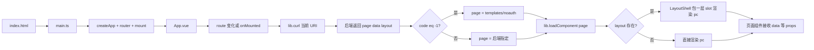

# 前端项目说明

本文档介绍本前端的构建方式、技术栈、配置组织以及从请求到页面渲染的完整流程，面向需要从零理解“怎么构建、怎么组织、页面怎么渲染”的开发者。

---

## 1. 项目简介与快速开始

### 技术栈

- **Vue 3** + **TypeScript** + **Vite**
- **Ant Design Vue**（UI 组件库）、**Vue Router**、**Axios**
- 其他业务相关库：ECharts、qrcode、xlsx、vuedraggable、vue3-print-nb 等

详见 [package.json](package.json)。

### 安装与命令

```bash
npm install
```

| 命令 | 说明 |
|------|------|
| `npm run dev` | 启动 Vite 开发服务器，支持热更新 |
| `npm run build` | 先执行 `vue-tsc -b` 做类型检查，再执行 `vite build` 打包 |
| `npm run preview` | 预览构建产物（本地静态服务） |

### 与后端的协作方式

前端通过 Vite 的 `server.proxy` 将请求路径 `/web` 代理到后端（默认 `http://localhost:3000`）。**页面内容由后端按“当前 URL 路径”决定**：前端请求当前 URI，后端返回要渲染的 Vue 组件路径（`page`）以及数据（`data`）、布局（`layout`），前端再动态加载对应 `.vue` 并渲染。因此路由表在前端是“单页 + 通配”，具体展示哪一页由后端返回的 `page` 决定。

---

## 2. TypeScript 基础与项目组织

### 2.1 基础概念

- **模块（Module）**  
  项目使用 **ESM**（`package.json` 中 `"type": "module"`）。所有业务代码通过 `import` / `export` 组织。`.vue` 单文件组件在 `<script lang="ts">` 中编写 TypeScript，通过类型声明 `declare module '*.vue'` 让 TS 将 `.vue` 当作模块识别（见 [src/end.d.ts](src/end.d.ts)）。

- **声明（Declaration）**  
  对没有类型定义或类型不完整的第三方库，在 [src/end.d.ts](src/end.d.ts) 中用 `declare module '包名'` 声明为模块，避免 `import` 时报错。例如：`declare module 'xlsx'`、`declare module 'vue3-print-nb'`。

- **路径别名**  
  在 [tsconfig.json](tsconfig.json) 的 `compilerOptions.paths` 中配置了以下别名，便于引用 `src` 下各目录：

  | 别名 | 对应目录 |
  |------|----------|
  | `@/*` | `src/*` |
  | `@libs/*` | `src/libs/*` |
  | `@assets/*` | `src/assets/*` |
  | `@styles/*` | `src/styles/*` |
  | `@modules/*` | `src/modules/*` |
  | `@templates/*` | `src/templates/*` |
  | `@components/*` | `src/components/*` |

  使用示例：`import lib from '@libs/lib'`、`import Table from '@components/table.vue'`。

### 2.2 项目内 TS 配置的组织方式

项目采用 **三份 TypeScript 配置文件**，通过 `references` 分离不同用途：

| 文件 | 作用 |
|------|------|
| [tsconfig.json](tsconfig.json) | 根配置：只定义 `paths` 和 `references`，`files: []`，不直接编译；`include` 由子项目指定。 |
| [tsconfig.app.json](tsconfig.app.json) | 应用代码：继承根配置和 `@vue/tsconfig/tsconfig.dom.json`，`include` 为 `src/**/*.ts`、`*.tsx`、`*.vue`，用于应用的类型检查与构建。 |
| [tsconfig.node.json](tsconfig.node.json) | Node 脚本：仅 `include: ["vite.config.ts"]`，用于 Vite 配置文件在 Node 环境下的类型检查。 |

**为何这样拆**：应用代码运行在浏览器，Vite 配置运行在 Node，两者环境和类型（如 `import.meta`、Node API）不同。通过 Project References 分离，既保证严格类型检查，又避免互相干扰。

**end.d.ts 中的模块声明**：当前在 [src/end.d.ts](src/end.d.ts) 中声明的模块包括：

- `*.vue`（Vue 单文件组件）
- `xlsx`、`diff2html`、`highlight.js`、`vue3-print-nb`（无类型或类型不完整的库）

新增无类型或类型不完整的第三方库时，在该文件中添加一行 `declare module '包名'` 即可。

---

## 3. Vite 基础与配置文件

### 3.1 Vite 是什么

Vite 是面向现代前端的构建工具：开发阶段基于 **原生 ESM** 按需编译、热更新；生产构建基于 **Rollup** 打包。

### 3.2 入口与 HTML

入口是项目根目录的 [index.html](index.html)。其中：

```html
<script type="module" src="/src/main.ts"></script>
```

指定了应用入口为 `src/main.ts`。Vite 会处理该 HTML，并正确解析 `/src/main.ts` 及其依赖。

### 3.3 配置文件：vite.config.ts

唯一配置文件为 [vite.config.ts](vite.config.ts)。

- **plugins**
  - `vue()`：`@vitejs/plugin-vue`，处理 Vue 3 单文件组件（SFC）。
  - `Components` + `AntDesignVueResolver`：`unplugin-vue-components` 按需解析模板中使用的 Ant Design Vue 组件并自动引入；`importStyle: 'less'` 表示按需引入组件样式。

- **resolve.alias**  
  与 `tsconfig.json` 的 `paths` 一一对应（`@`、`@libs`、`@assets`、`@styles`、`@modules`、`@templates`、`@components`），保证**运行时**解析的路径与**类型检查**使用的路径一致。

- **server**
  - `host: '0.0.0.0'`：允许通过局域网 IP 访问。
  - `allowedHosts`：允许的 host 列表。
  - `proxy`：将 `/web` 代理到 `http://localhost:3000`，前端请求带 `/web` 的接口会被转发到后端，避免开发时跨域。

### 3.4 与构建相关的脚本

- `npm run build` 实际执行：`vue-tsc -b && vite build`。
- `vue-tsc -b`：按 Project References 先做 TypeScript 类型检查并生成引用信息；若有类型错误会先失败。
- `vite build`：再执行 Vite 的生产构建。这样可保证构建产物在类型层面是安全的。

---

## 4. 第三方库的使用方式

### 4.1 依赖分类与用途

（以下按 [package.json](package.json) 归纳。）

| 类别 | 依赖 | 用途 |
|------|------|------|
| 框架与路由 | vue, vue-router | 应用框架与前端路由 |
| UI | ant-design-vue, @ant-design/icons-vue, @fortawesome/fontawesome-free | 组件库、图标 |
| 请求与工具 | axios, lodash | HTTP 请求（如 `lib.curl` 内部使用 axios）、工具函数 |
| 业务相关 | echarts, qrcode, xlsx, vuedraggable, vue3-print-nb | 图表、二维码、Excel、拖拽、打印 |

类型定义：对无自带类型的库，使用 `@types/xxx`（如 `@types/lodash`、`@types/qrcode`、`@types/xlsx`）或在 [src/end.d.ts](src/end.d.ts) 中 `declare module 'xxx'`。

### 4.2 按需引入与自动注册

- **Ant Design Vue**  
  通过 `unplugin-vue-components` 的 `AntDesignVueResolver`，在模板中直接使用 `<a-button>`、`<a-table>` 等即可，**无需**在 `main.ts` 中全局注册；插件会在编译时按需解析并引入对应组件与样式（`importStyle: 'less'`）。

- **其他组件**  
  业务组件和公共组件均通过**显式 import** 引入，例如：  
  `import Table from '@components/table.vue'`、`import lib from '@libs/lib'`。

### 4.3 无类型库

以下库在 [src/end.d.ts](src/end.d.ts) 中通过 `declare module '...'` 声明，避免 import 时报错：  
`xlsx`、`diff2html`、`highlight.js`、`vue3-print-nb`。  
新增类似库时，在同一文件中增加一行 `declare module '包名'` 即可。

---

## 5. src 代码框架：目录职责与页面渲染流程

### 5.1 目录结构一览

```
src/
├── main.ts              # 应用入口：创建 Vue 实例、注册路由与插件、挂载 #app，并引入全局样式
├── app.vue              # 根组件：根据当前 URL 请求后端，按返回的 page/data/layout 动态渲染页面
├── end.d.ts             # 类型声明（.vue、无类型库等）
├── templates/           # 布局与通用页面壳
│   ├── layout.vue       # 主布局：侧栏、header、title、body slot、footer
│   ├── sider-open.vue   # 侧栏展开
│   ├── sider-fold.vue   # 侧栏折叠
│   ├── header.vue       # 顶栏
│   ├── title.vue        # 面包屑/标题
│   ├── footer.vue       # 页脚
│   ├── index.vue        # 通用列表页模板（Searcher + Table + Pager + 工具栏/弹窗）
│   ├── error.vue        # 错误页
│   └── noauth.vue       # 未授权页
├── components/          # 可复用 UI 组件
│   ├── table.vue        # 表格（支持排序、操作列、批量选择等）
│   ├── tree.vue         # 树形结构
│   ├── pager.vue        # 分页
│   ├── searcher.vue     # 搜索区
│   ├── button.vue       # 按钮
│   ├── lock.vue         # 锁定/权限类
│   ├── card.vue         # 卡片
│   ├── chart.vue        # 图表封装
│   └── ...              # 其他通用组件
├── libs/                # 纯 TS 工具库
│   ├── lib.ts           # 核心：curl、loadComponent、loadModal、redirect 等
│   ├── swal.ts          # 弹窗/提示封装
│   ├── excel.ts         # Excel 导出等
│   ├── oplib.ts         # 表格操作等
│   ├── strlib.ts        # 字符串工具
│   ├── arrlib.ts        # 数组工具
│   └── gitdiff.ts       # 差异展示等
├── modules/             # 按业务/后端路径划分的页面组件
│   ├── base/            # 基础模块（用户、角色、导航树、图表、操作日志等）
│   │   ├── user/        # 用户（edit、join 等）
│   │   ├── role/        # 角色（access 等）
│   │   ├── navtree/     # 导航树
│   │   ├── chart/       # 图表（bar、line、pie、route 等）
│   │   ├── op/          # 操作日志（index、log、logs、log-diffs）
│   │   └── helper/      # 辅助（fa-icon、widget、playground）
│   ├── prod/            # 产品/业务模块
│   │   └── store/       # 门店（detail、plus、minus、reject、history、qrcode 等）
│   └── res/             # 资源类
│       └── ip/          # IP（flow 等）
└── styles/              # 全局与业务样式
    ├── custom.css       # 自定义变量、基础样式
    ├── ant.css          # Ant Design 相关覆盖
    ├── btn.css          # 按钮
    ├── text.css         # 文本
    ├── table.css        # 表格
    ├── badge.css        # 徽标
    └── portlet.css      # portlet 容器
```

### 5.2 路由设计（与后端协作）

在 [src/main.ts](src/main.ts) 中：

- 路径 `/` 重定向到 `/base/user/edit`。
- 其余路径 `/:path(.*)*` 全部匹配到**同一个**根组件 `App`。

前端**不为每个页面单独配置路由表**，而是“单页 + 后端返回 page 路径”：路由变化只会驱动 `App` 根据当前 path 重新请求后端，后端返回 `page`、`data`、`layout`，前端再根据 `page` 动态加载对应 Vue 组件并渲染。

### 5.3 页面渲染流程

整体流程如下（从加载到最终渲染）：



**分步说明：**

1. **用户访问或前端路由变化**（例如 `/base/op`）  
   `App.vue` 的 `watch(route.fullPath)` 或 `onMounted` 会触发 `loadResources`。

2. **请求当前页**  
   `lib.curl(uri)` 请求 `/web` + 当前 URI（如 `/web/base/op`）。后端（如 Gin）根据 path 处理，通过 `RenderDataPage` 返回 JSON：`{ page, data, layout }`。其中 `page` 一般为 `"modules" + path`（例如 `modules/base/op/index`），对应前端的 `src/modules/base/op/index.vue`。

3. **未授权处理**  
   若后端返回 `code === -1`，前端将 `page` 设为 `'templates/noauth'`，否则使用后端返回的 `page`、`data`、`layout`。

4. **动态加载页面组件**  
   `lib.loadComponent(page)` 在 [src/libs/lib.ts](src/libs/lib.ts) 中实现：通过 `import.meta.glob('../**/*.vue')` 得到所有 `.vue` 的懒加载函数，将 `page` 转成路径 `../${page}.vue`，用 `defineAsyncComponent` 包装后返回异步组件，赋给根组件中的 `pc`。

5. **是否套布局**  
   若 `layout` 非空，则用 `templates/layout.vue`（LayoutShell）包一层，通过默认 slot 渲染 `pc`，并把 `data`、`layout` 等作为 props 传入；否则直接渲染 `pc`（仍传 `data`）。

6. **页面组件内部**  
   具体页面（如 `templates/index.vue` 或 `modules/base/op/index.vue`）接收 `rules`、`tool`、`lock`、`option`、`arg` 等 props，可能再请求列表数据，或通过 `lib.loadModal` 打开弹窗。弹窗的组件路径同样由后端返回（`page` + `props`），前端再次通过 `loadComponent` 渲染到 `<component :is="modalCurr">`。

### 5.4 关键代码引用

- **动态加载**  
  [src/libs/lib.ts](src/libs/lib.ts)：第 6 行 `const pages = import.meta.glob('../**/*.vue')`；第 61–68 行 `loadComponent(page)` 将 `page` 转为 `../${page}.vue` 并返回 `defineAsyncComponent(...)`。

- **根组件**  
  [src/app.vue](src/app.vue)：根据 `hasLayout` 选择 LayoutShell 或普通 `div`；根据 `pc` 与 `pageKey` 渲染 `<component :is="pc" v-bind="data" />`；`loadResources` 中调用 `lib.curl(uri)` 并根据返回设置 `page`、`data`、`layout`，再 `lib.loadComponent(page)` 得到 `pc`。

- **后端约定**  
  页面接口返回：`{ page?, data?, layout? }`（若需鉴权则带 `code`）；弹窗接口返回：`{ page, props }`。前端约定 `page` 为相对 `src` 的路径（如 `modules/base/op/index`），对应文件为 `src/modules/base/op/index.vue`。

### 5.5 列表页与弹窗的协作

以 [src/templates/index.vue](src/templates/index.vue) 为例：

- 接收后端下发的 `rules`、`tool`、`lock`、`option`、`arg` 等，内嵌 **Searcher**、**Table**、**Pager** 以及工具栏按钮、锁定组件等。
- 工具栏按钮或表格行操作可调用 `lib.loadModal(url, modalCurr, modalProps)`：请求该 `url`，后端返回弹窗的 `page` 和 `props`，前端用 `loadComponent(page)` 得到组件并赋给 `modalCurr`，`props` 赋给 `modalProps`，在模板中通过 `<component :is="modalCurr" v-bind="modalProps" />` 渲染。
- 列表页与弹窗都由后端“指定组件路径 + 数据”，前端只负责按路径加载对应 `.vue` 并传入 props。

---

## 6. 可选补充

- **开发时后端地址**  
  若后端不在本机，可修改 [vite.config.ts](vite.config.ts) 中 `server.proxy['/web'].target` 为实际后端地址。

- **添加新页面**  
  在 `src/modules` 下按后端 path 新建目录与 `.vue` 文件（例如 `src/modules/foo/bar.vue`），后端在对应接口中返回 `page: 'modules/foo/bar'` 即可被 `loadComponent` 解析并加载。

- **添加新全局样式**  
  在 [src/main.ts](src/main.ts) 中增加一行：`import '@styles/你的样式.css'`。
